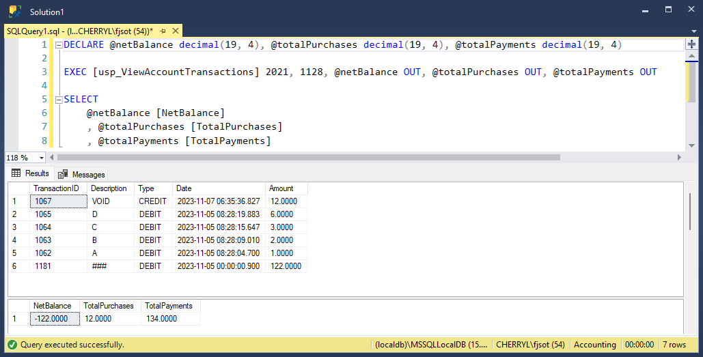
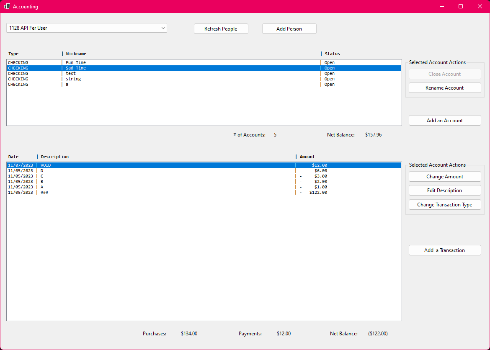
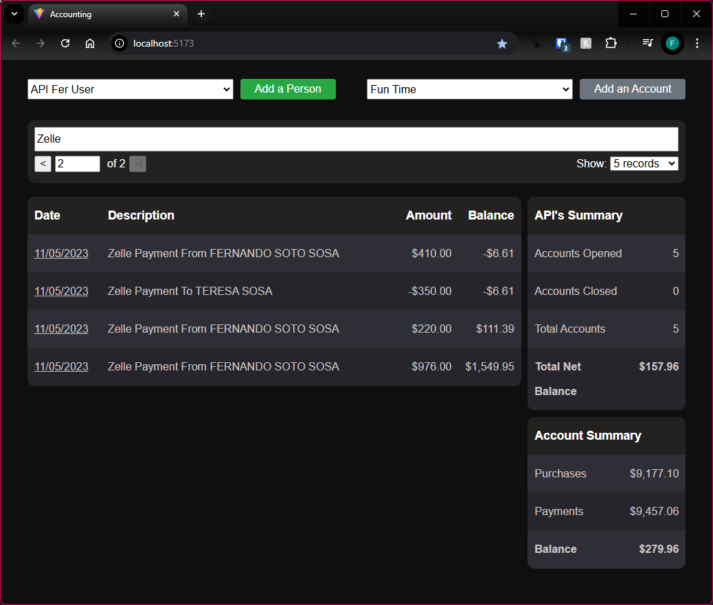

# Personal Lending Tracker (codename: Accounting)

This personal project was inspired by my drive to help my siblings learn about loans and credit, and it was fueled by my desire to apply and expand my software development skills.

## **About This Project**

The Personal Lending Tracker started as a simple database-driven program to manage loans, people, and transactions—essentially a **more dynamic version of Excel**. Over time, it evolved into a **full-stack application** with various technologies and concepts integrated along the way.

### **Development Journey**

1. **Database-Driven Beginnings**

   - Created a SQL-based database to track loans, users, and transaction history.
   - Applied database normalization principles and utilized **SQL stored procedures** and **triggers** for data integrity and automation.

2. **Windows Form Application**

   - As the complexity of tracking transactions grew, I developed a **Windows Form application** to make user interaction easier.
   - This phase allowed me to enhance my skills in **UI/UX design** and improve the **accessibility and usability** of the system.

3. **API-First Approach**

   - Recognizing the potential for better scalability, I transitioned to a **RESTful API** architecture.
   - Built an API to expose data endpoints following **RESTful standards**, and learned about concepts like **service layers** and **DAO (Data Access Object) design patterns**.

4. **React Frontend**
   - To further expand the application's capabilities, I used **React.js** to build a modern, interactive, and responsive web-based UI.
   - Key concepts applied included **pagination**, **error handling**, and **responsive design**, ensuring a smoother, more user-friendly experience.

## **Technologies Used**

- **Frontend**: React.js
- **Backend**: RESTful API (C#)
- **Database**: SQL (with stored procedures, triggers)
- **Desktop Application**: Windows Forms (C#)
- **Design Patterns**: Service Layer, DAO

## **What’s Next?**

This project is still a part of my daily workflow, and I’m continuously iterating on it. Upcoming features and improvements include:

- **Authentication & Authorization**: Implementing role-based access to ensure user privacy and security.
- **Exception Handling Framework**: Building a unified framework for handling exceptions and errors consistently across the stack.
- **Mobile Client**: Creating a mobile-friendly client to provide users with a more portable experience.
- **API Integration with Windows Form App**: Leveraging the API within the existing Windows Form application.
- **Cloud Hosting**: Exploring hosting options and migrating the database to a **cloud service** for better scalability and availability.

## **How to Run**

1. **Clone the Repository**:
   ```bash
   git clone https://github.com/fsoto-GH/Accounting
   ```
2. **Set Up Database**:

   - Run the following scripts in the **Accounting/DATABASE_SQL** folder to generate the database on your local machine:
     - `CREATE_DB.sql`
     - `STORED_PROCS.sql`
     - `TRIGGERS.sql`
   - Ensure the SQL Server is running and the connection string is updated in the `appsettings.json` file.

3. **Run the API**:

   ```bash
   dotnet run
   ```

4. **Run the React Frontend (this uses Vite for improved dev experience)**:

   ```bash
   cd Accounting/Accounting.Web
   npm run dev
   ```

5. **Access the Application**:

   - ToVisit `http://localhost:5173` to use the web-based application.

6. **Access the Windows Form App**

   This step is optional, but you can build the Windows Form app and publish it to have a local executable. The app does not currently require the API to be running, as it connects to the database directly.

7. **Run the Windows Form Application**
   - Open the project in Visual Studio.
   - Ensure the Windows Form project is set as the startup project.
   - Build the solution to restore all necessary dependencies.
   - Press F5 or click on the Start button to run the application.
   - Use the application to add people, track loans, and view transaction history.
   - Additionally, you can publish the project and install it as an executable program.

## **Screenshots**







## **Contributing**

This project is a personal endeavor, but if you'd like to suggest improvements or report issues, feel free to submit an issue or a pull request.

## **License**

This project is licensed under the **MIT License**. See the `LICENSE` file for more information.
